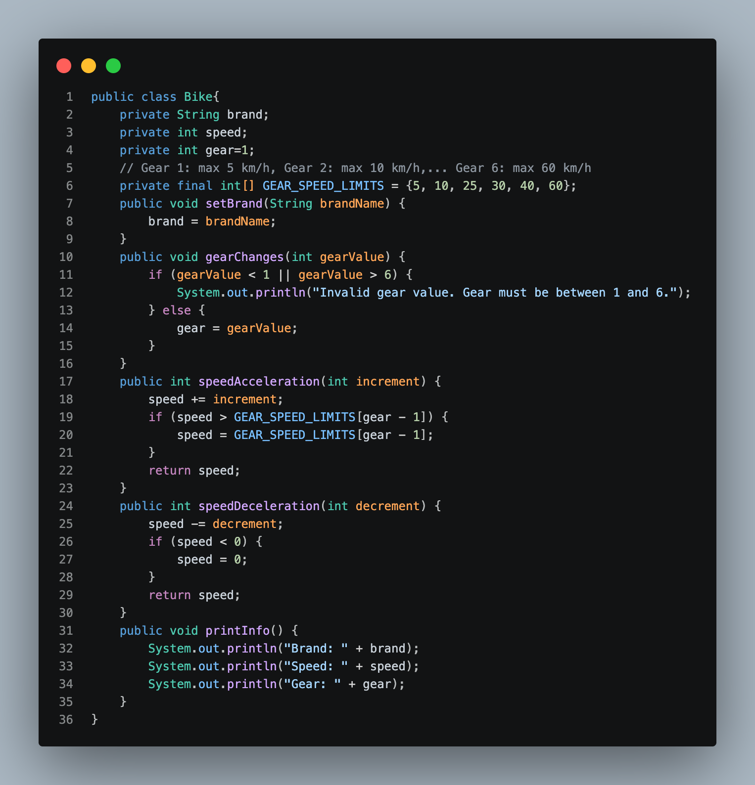
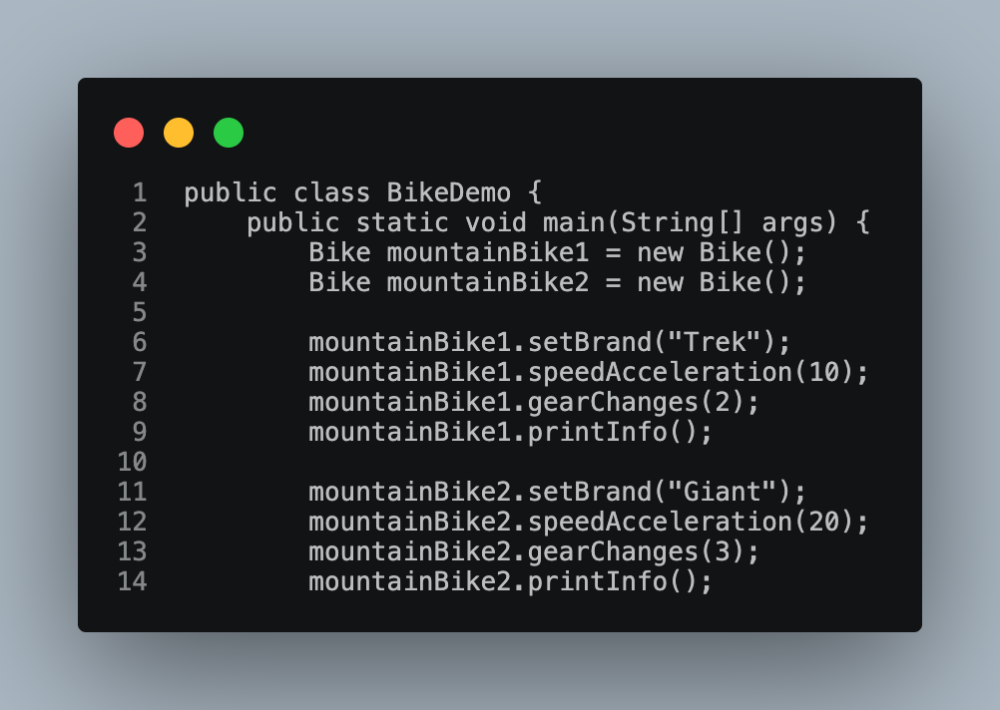
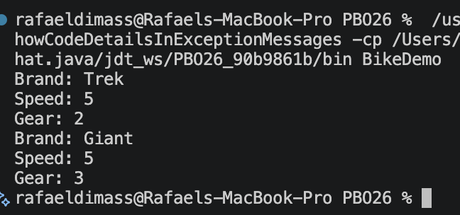
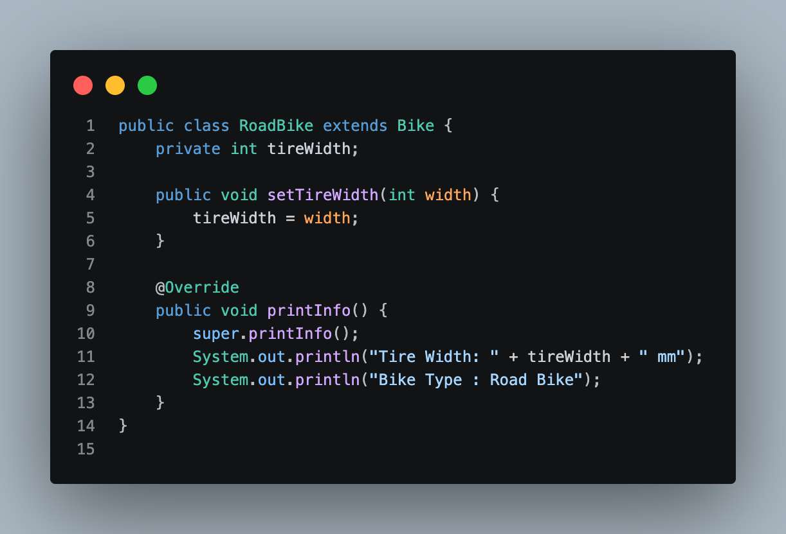
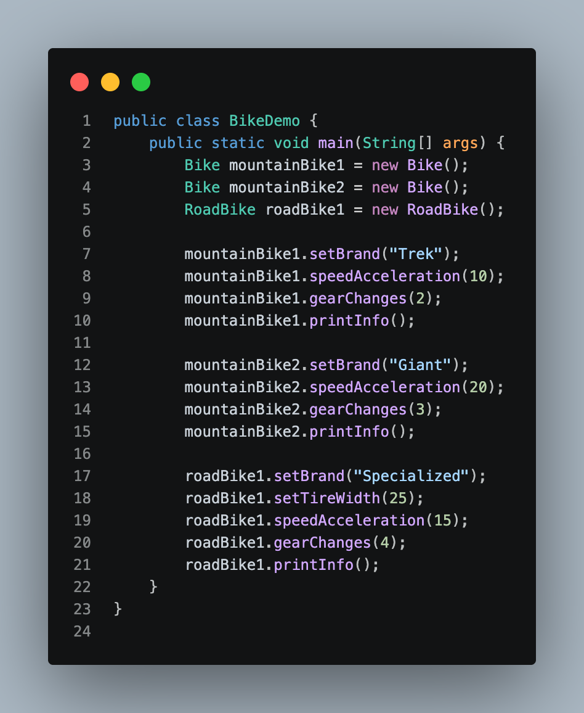
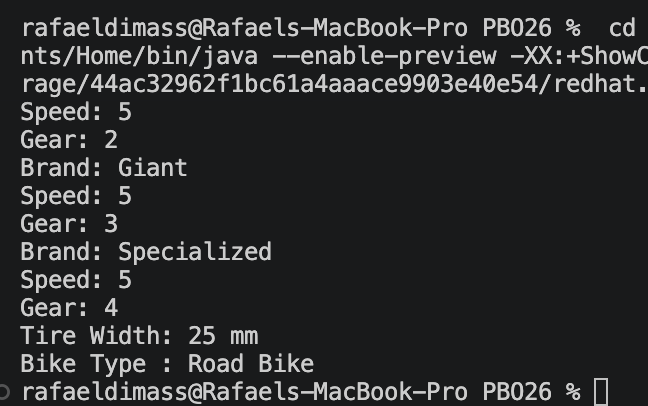

# LAPORAN JOBSHEET 1
## Percobaan 1
### 1. Class Bike
- 
### 2. Class Main
- 
### 3. Hasil
- 
## Percobaan 2
### 1. Class RoadBike
- 
### 2. Perubahan Class Main
- 
### 3. Hasil
- 

## PERTANYAAN
### 1. Jelaskan perbedaan antara object dengan class! 
### * Object adalah suatu rangkaian dalam program yang terdiri dari state dan behavior. Sedangkan class adalah blueprint atau protoype dari object.
### 2. Jelaskan alasan gear dan brand dapat menjadi atribut dari object Bike
### * Sebuah Bike (sepeda) pasti memiliki Brand (merek) dan Gear (gigi).
### 3. Sebutkan salah satu kelebihan utama dari pemrograman berorientasi objek dibandingkan dengan pemrograman prosedural!
### * OOP dibagi menjadi beberapa objek, sehingga jika ada error atau menambah fitur hanya mengubah class yang berkaitan saja tanpa merubah keseluruhan program, tidak perlu merubah seluruh kode dari atas sampai bawah.
### 4. Apakah diperbolehkan melakukan pendefinisian dua buah atribut dalam satu baris kode seperti "public String nama, alamat;"?
### * Boleh, selama tipe data sama.
### 5. Pada class RoadBike, jelaskan alasan atribut brand, speed, dan gear tidak lagi ditulis di dalam class tersebut!
### * Karena atribut brand, speed, dan gear telah ada di class Bike. Class roadBike merupakan pewaris dari class Bike (inheritance).

 
